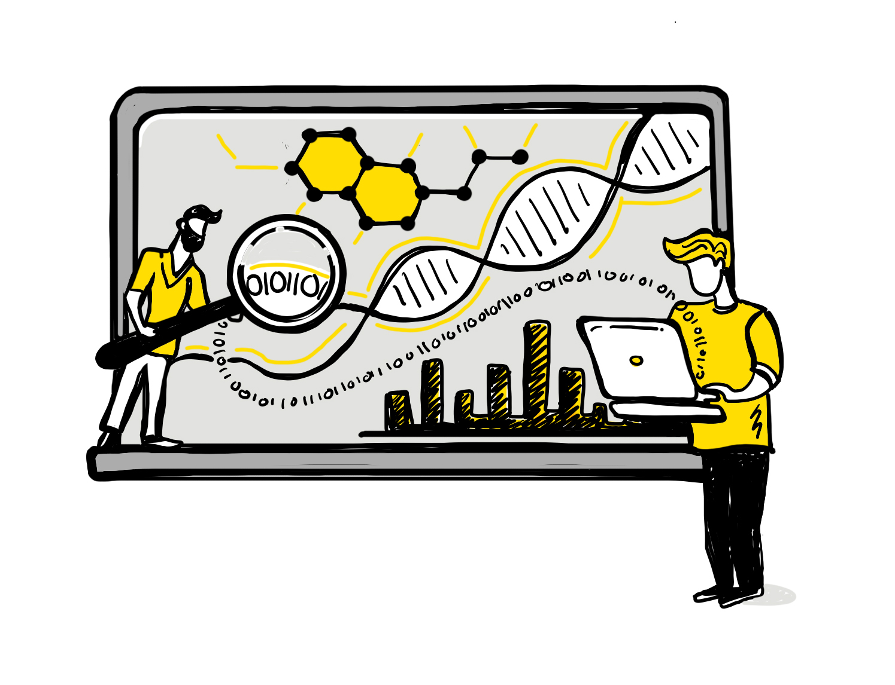
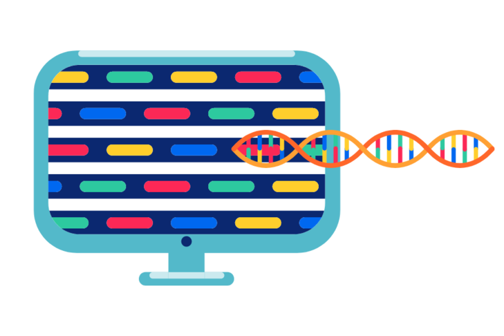
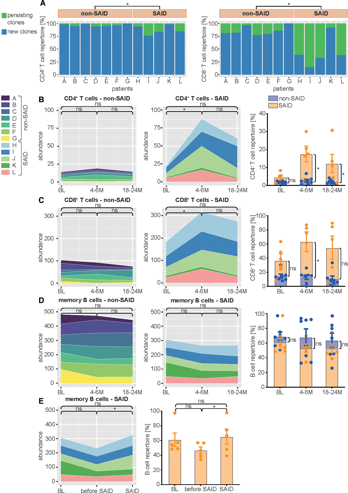
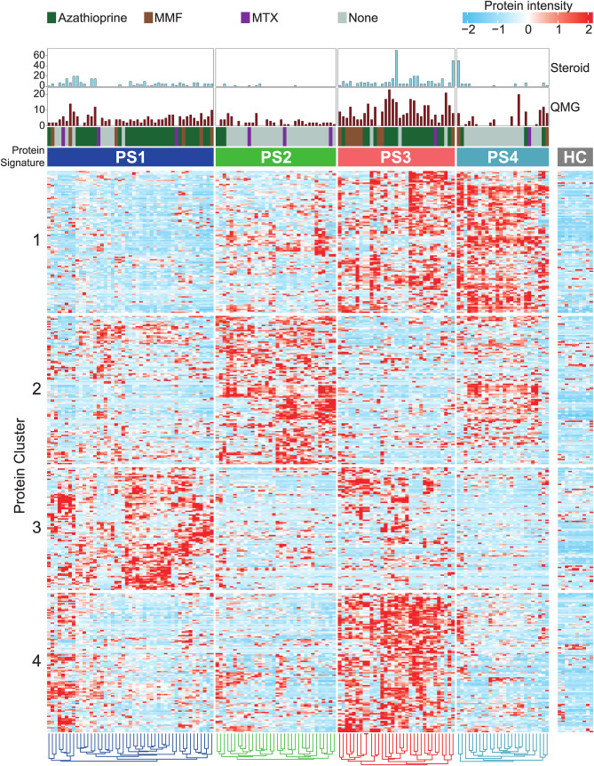
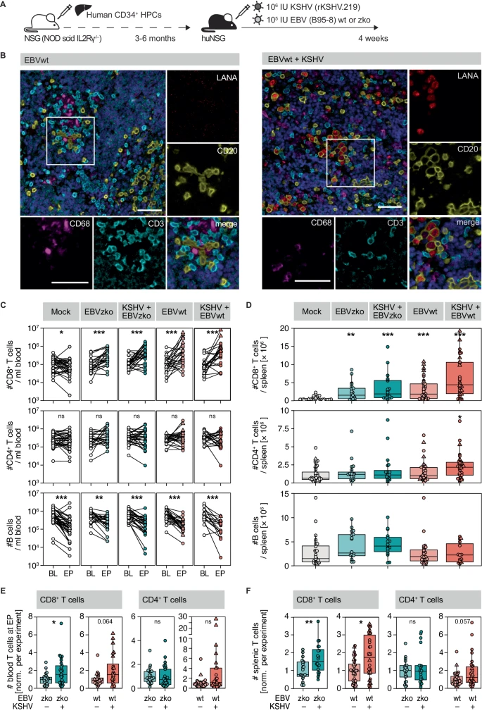
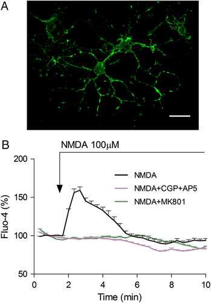
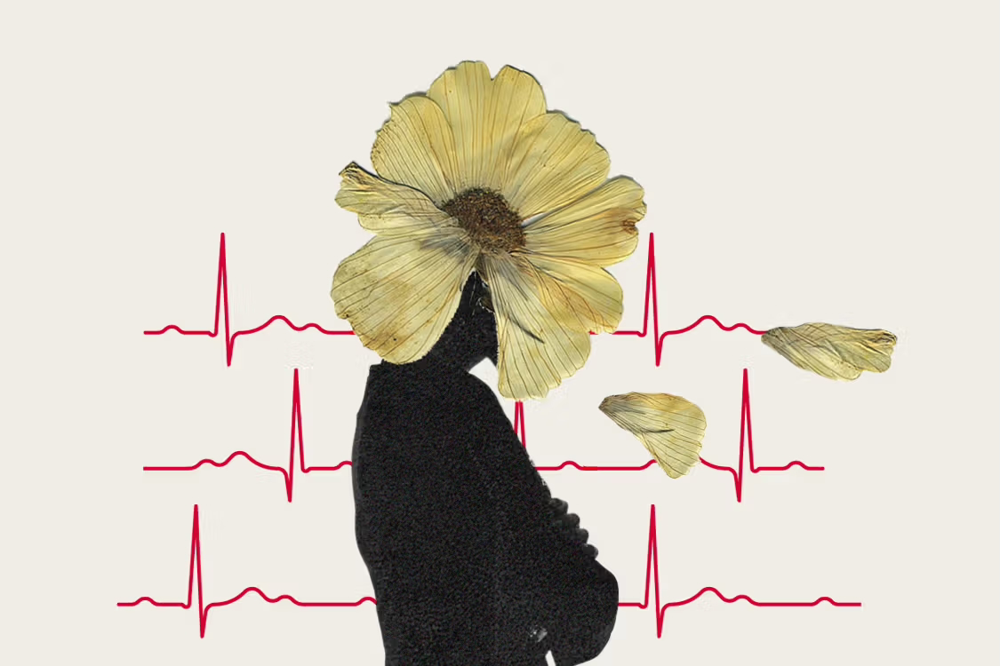
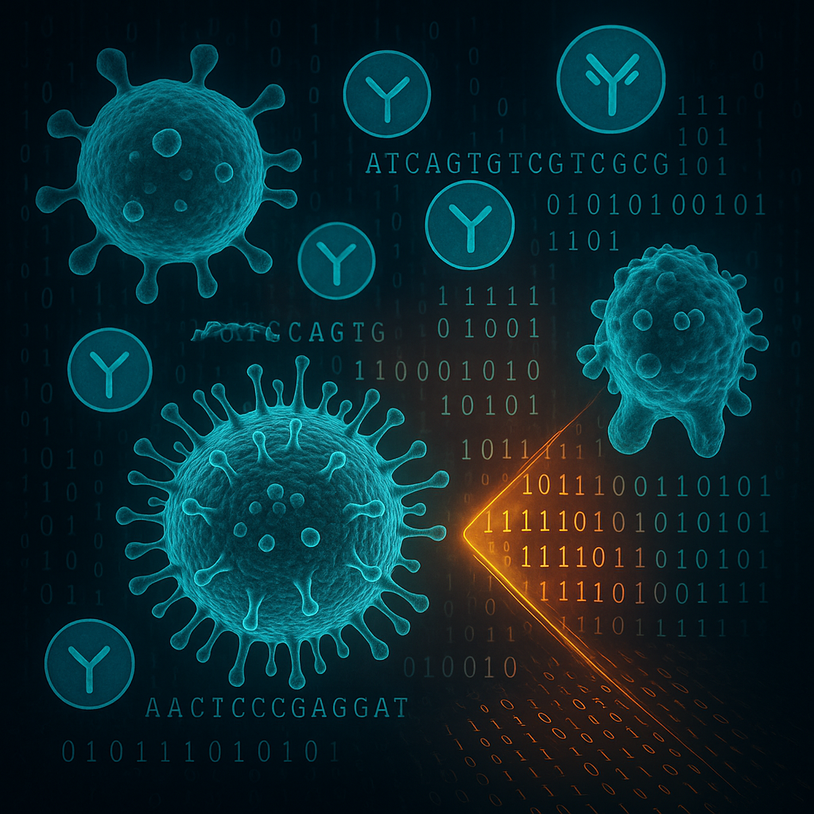
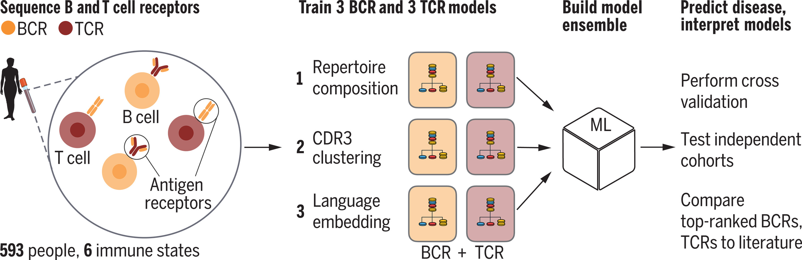

  <!-- Left side: Profile picture (circle) -->
  

    
  

  <!-- Middle section: Additional text -->
  

    
<b>Expert Immunology Data Science, IMM Data Science Department, Novartis Pharma, Basel, Switzerland</b>

  

  <!-- Right side: Logos for LinkedIn, Google Scholar, GitHub -->
  

    <ul style="list-style: none; padding: 0;">
      <li style="margin-bottom: 8px;"></li>
      <li style="margin-bottom: 8px;"></li>
      <li style="margin-bottom: 8px;"></li>
      <li style="margin-bottom: 8px;"></li>
      <li style="margin-bottom: 8px;"></li>
      
    </ul>
  

---
<html>
<head>
  <meta name="viewport" content="width=device-width, initial-scale=1.0">
  <title>My Website</title>
  
</head>
<body>

  
  <nav style="display: flex; justify-content: space-between;">
    <a href="#top" class="home">Home</a>
    <a href="#news">News</a>
    <a href="#about-me">About Me</a>
    <a href="#expertise">Expertise</a>
    <a href="#relevant-methods">Relevant Methods</a>
    <a href="#research-highlights">Research Highlights</a>
    <a href="#tools-and-technologies">Tools and Technologies</a>
    <a href="#professional-experiences">Professional Experiences</a>
    <a href="#education">Education</a>
    <a href="#research-articles">Research Articles</a>
    <a href="#complete-list-of-publications">Complete List of Publications</a>
    <a href="#certifications">Certifications</a>
    <a href="#awards-and-grants">Awards and Grants</a>
    <a href="#interests">Interests</a>
    

      <a href="#blog">Blog</a>
      <a href="#contact-me">Contact Me</a>
    

  </nav>

  

 
 
</body>
</html>

---

## <b>News</b>

  &#9658; <b>May 25, 2025: Pre-print Announcement</b>

  

    <ul>
      We're excited to announce our manuscript is now available as a pre-print:
      <a href="https://www.biorxiv.org/content/10.1101/2025.05.18.654720v1" target="_blank">
        <b>View on bioRxiv</b>
      </a>
    </ul>
  

  &#9658; <b>November 4, 2024: My new position</b> 
  

  

    <ul>
      I have started a position as Expert Immunology Data Science at Novartis, Switzerland.
     </ul>
  

  &#9658; <b>Conference presentation</b> (click to read more)

  

    <ul>
        <b>June 30, 2024:</b> I have given an oral presentation about our recent work at <a href="https://ectrims.eu/ectrims2024/" target="_blank">The 40th Congress of the European Committee for Treatment and Research in Multiple Sclerosis</a>, which will take place on 18-20 September 2024 in Copenhagen, Denmark. The presentation is titled <b>"Secondary Autoimmunity after Alemtuzumab treatment in MS: Longitudinal immune repeertoire study suggests pre-existing predisposition ".</b>
      </ul>
  

  

    <ul>
        <b>May 10, 2024:</b> I am going to present our recent work at <a href="https://sng-ssn2024.congress-imk.ch" target="_blank">Swiss Neurological Society (SNS) annual meeting 2024 </a>, which will take place on June 6th, 2024 in Basel, Switzerland. The presentation is titled <b>"Dynamic Reshaping of Lymphocyte Repertoires in Multiple Sclerosis Patients Treated with Alemtuzumab: Insights into Secondary Autoimmunity".</b>
      </ul>
  

  &#9658; <b>New publication </b> (click to read more)

  

      <ul>
        <b>July 02, 2024:</b> Our recent article has been published in <a href="https://www.thelancet.com/journals/ebiom/article/PIIS2352-3964(24)00266-4/fulltext" target="_blank"><b>eBioMedicine</b>:</a> Christopher Nelke, Christina B. Schroeter, <strong>Sumanta Barman</strong>, Frauke Stascheit, Lars Masanneck, Lukas Theissen, Niklas Huntemann, Sara Walli, Derya Cengiz, Vera Dobelmann, Anna Vogelsang, Marc Pawlitzki, Saskia Räuber, Felix F. Konen, Thomas Skripuletz, Hans-Peter Hartung, Simone König, Andreas Roos, Andreas Meisel, Sven G. Meuth, and Tobias Ruck. The article is titled <b>"Identification of disease phenotypes in acetylcholine receptor-antibody myasthenia gravis using proteomics-based consensus clustering"</b> and for this study, I had the privilege of conducting the B cell receptor (BCR) repertoire analysis of myasthenia gravis patients using Python and R-based tools, a bash scripts-based pipeline, and custom scripts.
      </ul>
  

  

  

      <ul>
        <b>June 10, 2024:</b> Our recent article has been published in <a href="https://www.nature.com/articles/s41467-024-49209-w" target="_blank"><b>Nature Communications</b>:</a> Nicole Caduff, Lisa Rieble, Michelle Böni, Donal McHugh, Romin Roshan, Wendell Miley, Nazzarena Labo, <strong>Sumanta Barman</strong>, Matthew Trivett, Douwe M. T. Bosma, Julia Rühl, Norbert Goebels, Denise Whitby, Christian Münz. The article is titled <b>"T cell specificity and protective functions elicited by KSHV infection of B cells in vivo"</b> and I was involved in the TCR repertoire data analysis in EBV and EBV+KSHV infected humanized mice.
      </ul>
  

---

## <b>About Me</b>

  

    
  

I am a computational immunology scientist with extensive expertise in central nervous system (CNS) and systemic autoimmune diseases. My work focuses on leveraging computational immunology, molecular biology, and cutting-edge '-omics' technologies to extract valuable insights and drive significant progress in drug development for autoimmune diseases. I possess extensive expertise in analysis of large multi-omics (single cell and bulk immunogenomics, single cell and multimodal transcriptomics, proteomics) data sets, next-generation sequencing (NGS), both in laboratory and computational, and single B cell recombinant antibody technology.   My mastery of data analysis using Python and R, coupled with machine learning and deep learning-based tools, empowers me to make informed decisions based on data and evidence. A significant aspect of my work involves data-driven investigation of treatment effects from various immunotherapies on patients' immune repertoires, as well as contributing to the development and characterization of recombinant human monoclonal antibodies derived from clonally expanded plasma cells (cePc). I possess good knowledge of statistical approaches, utilizing tools such as R, SPSS and GraphPad Prism, to derive meaningful insights and statistical interpretations in research. Furthermore, I am deeply passionate about the application of artificial intelligence (AI) in healthcare and its potential to revolutionize precision medicine.  My dedication and perseverance have resulted in numerous scientific publications and presentations, both oral and poster, at national and international conferences. Moreover, I have had the privilege of mentoring multicultural students in all aspects of research, including project conception, methodology, data analysis, presentation, and report writing for bachelor's, master's, and PhD theses.

---

## <b>Expertise</b>

- Molecular biology and computational immunology
- Multi-omics technologies
- Next generation sequencing (NGS)
- Bulk and single cell RNA-Seq data analysis
- Recombinant human monoclonal antibody technology

---

## <b>Relevant Methods</b>

  

    
  

+ NGS library preparation, data acquisition, quality control, visualization, statistical analysis, and interpretation
+ Bulk RNA-seq, single cell RNA-Seq, CITE-seq, transcriptomics, proteomics, immunogenomics data analysis using R and Python-based tools, custom scripts
and bash scripts-based pipeline
+ Computational downstream analysis of scRNA-seq, immunogenomics data using machine and deep learning-based tools
+ Mammalian cell culture
+ Stable and transient cell line generation
+ Cloning, Transformation, Transfection
+ PCR, Single cell RT-PCR, qPCR
+ Flow cytometry
+ Affinity chromatography

## <b>Research Highlights</b>

<b>Single cell sequencing:</b>
         <ul>
                <li>Cerebrospinalcord fluid (CSF) and peripheral blood (PB) single cell-based multi-omics approach (transcriptomics, proteomics, immune repertoire) on cohorts of different autoimmune encephalitis patients (anti-GAD, anti-IgLON5, Seronegative autoimmune encephalitis)</li>
                <li>CITE-seq data analysis of Batf+/+ and Batf-/- mouse bone marrow progenitor cells</li>
          </ul>

<b>Bulk sequencing:</b>
        <ul>
  <li>Investigate longitudinal treatment effects of anti-CD20 specific disease-modifying therapy on multiple sclerosis (MS) patients’ immune repertoire</li>
  <li>Investigate longitudinal treatment effects of anti-CD52 disease-modifying therapy on the peripheral immune repertoire of multiple sclerosis patients</li>
  <li>Investigate longitudinal treatment effects of S1P receptor modulator on autimmune lymphocyte repertoire in multiple sclerosis (MS)</li>
  <li>BCR repertoire data analysis in Myasthenia gravis (MG) patients</li>
  <li>TCR repertoire data analysis in EBV and EBV+KSHV infected humanized mice</li>
        </ul>

<b>Recombinant monoclonal antibody technology:</b>
        <ul>
  <li>Development and characterization of recombinant human monoclonal antibodies from clonally expanded plasma cells (cePc) of patients with different autoimmune encephalitis (anti-GABA A, anti-IgLON5, anti-NMDAR, anti-CASPR2, anti-LGI1, anti-Hu)</li>        
  <li>Recombinant monoclonal antibodies (anti-GABA A, NMDAR) effect on human brain organoid</li>
  <li>Harpes simples virus 1 (HSV1) encephalitis patient CSF derived recombinant human monoclonal antibody development and characterization</li>

  </ul>
  

---

## <b>Tools and Technologies</b>

<head>
  
</head>
<body>
  

    
    
  

   
  <strong>Programming and Scripting Languages:</strong> Python and R (advance), HTML (beginner) 
  <strong>Integrated Development Environments (IDEs) and Notebooks:</strong> RStudio, Jupyter Notebook, Visual Studio Code 
  <strong>Bioinformatics:</strong> Bioconductor, IMGT, IMGT/HighV-QUEST, IgBlast, BLAST, MAFFT, VDJdb etc. 
  <strong>Data Analysis and Visualization:</strong>
  <pre><b>Single cell sequencing data analysis:</b> Cell Ranger, STAR, Seurat, Scanpy, Scirpy, SCVItools, Change-O, SHazaM, Monocle, Harmony, Dandelion, scRepertoire, NAIR, Propeller, Enclone, GLIPH, Immunearch, Immcantation, Dowser, Tcrdist3, Loupe Browser, Loupe V(D)J Browser, DESeq2, limma etc.  <b>Bulk seq analysis:</b> MiXCR, STAR, VDJtools, Immunearch, Immcantation framework  <b>Others:</b> R Markdown, Pandas, NumPy, Ggplot2, Plotly, Matplotlib, UMAP, t-SNE, TCRex, ViClod etc.</pre>
  <strong>Statistical Analysis:</strong> R, SPSS, GraphPad Prism 
  <strong>Operating system:</strong> Linux, Mac-OS, Windows 
  <strong>Containerization:</strong> Docker, Singularity 
  <strong>Version Control:</strong> Git 
  <strong>Others:</strong> High-performance computing, Machine learning and Deep learning (Intermediate) 
</body>

---

## <b>Professional Experiences</b>

        
2024 to date

        
<b>Expert Immunology Data Science</b>

        
IMM Data Science Department, Novartis, Switzerland

 
        
2021 - 2024

        
<b>Postdoctoral researcher</b>

        
Department of Neurology, University Hospital Düsseldorf, Germany

 

  
2016 - 2021

  
<b>Doctoral researcher</b>

  
Department of Neurology, University Hospital Düsseldorf, Germany

 
  

  

---

## <b>Education</b>

  

  

        
2016 – 2021

        
<b>PhD in Neuroimmunology</b> (Grade: <b>summa cum laude</b>)

        
Heinrich Heine University Düsseldorf, Germany

        
Thesis: Single B cell antibody technology and high-throughput immune repertoire sequencing as complementary tools to better understand central nervous system (CNS) inflammation and treatment effects

  

 

  

        
2012 – 2015

        
<b>Master of Science in Biochemistry</b> (Grade: 1.8)

        
Ruhr University Bochum, Germany

        
Thesis: Identification of antigenic targets in the humoral immune response of inflammatory CNS diseases

  

 

  

        
2006 – 2010

        
<b>Bachelor of Science in Genetic Engineering & Biotechnology</b> (Grade: 1.5 in German grading system)

        
Shahjalal University of Science and Technology, Bangladesh

        
Thesis: Characterization of oral microbes and their antibiotic sensitivity pattern

  

  

---

## <b>Research Articles</b>

  &#9658; <b>Selected Publications</b> (click to read more)

  
<em>Computational immunology:</em>

  <ol>
    <li>
      <strong><a href="https://academic.oup.com/brain/article/145/5/1711/6590581" target="_blank">Alemtuzumab-induced immune phenotype and repertoire changes: implications for secondary autoimmunity</a></strong> 
      <em>Authors:</em>
      

        Tobias Ruck#, <strong>Sumanta Barman#</strong>, Andreas Schulte-Mecklenbeck#, Steffen Pfeuffer#, Falk Steffen, Christopher Nelke, Christina B Schroeter, Alice Willison, Michael Heming, Thomas Müntefering, Nico Melzer, Julia Krämer, Maren Lindner, Marianne Riepenhausen, Catharina C Gross, Luisa Klotz, Stefan Bittner, Paolo A Muraro, Tilman Schneider-Hohendorf, Nicholas Schwab, Gerd Meyer zu Hörste, Norbert Goebels, Sven G Meuth, Heinz Wiendl. <strong>#equally contributing first authors</strong>
      

      <em>Journal:</em> Brain 
      <em>Year:</em> 2022 
      
    </li>
     
    <li>
      <strong><a href="https://www.thelancet.com/journals/ebiom/article/PIIS2352-3964(24)00266-4/fulltext" target="_blank">Identification of disease phenotypes in acetylcholine receptor-antibody myasthenia gravis using proteomics-based consensus clustering</a></strong> 
      <em>Authors:</em>
      

        Christopher Nelke, Christina B. Schroeter, <strong>Sumanta Barman</strong>, Frauke Stascheit, Lars Masanneck, Lukas Theissen, Niklas Huntemann, Sara Walli, Derya Cengiz, Vera Dobelmann, Anna Vogelsang, Marc Pawlitzki, Saskia Räuber, Felix F. Konen, Thomas Skripuletz, Hans-Peter Hartung, Simone König, Andreas Roos, Andreas Meisel, Sven G. Meuth, and Tobias Ruck.
      

      <em>Journal:</em> eBioMedicine 
      <em>Year:</em> 2024 
      
    </li>
     
    <li>
      <strong><a href="https://www.frontiersin.org/journals/immunology/articles/10.3389/fimmu.2023.1198860/full" target="_blank">Classifying flow cytometry data using Bayesian analysis helps to distinguish ALS patients from healthy controls</a></strong> 
      <em>Authors:</em>
      

        Saskia Räuber, Christopher Nelke, Christina B Schroeter, <strong>Sumanta Barman</strong>, Marc Pawlitzki, Jens Ingwersen, Katja Akgün, Rene Günther, Alejandra P Garza, Michaela Marggraf, Ildiko Rita Dunay, Stefanie Schreiber, Stefan Vielhaber, Tjalf Ziemssen, Nico Melzer, Tobias Ruck, Sven G Meuth, Michael Herty.
      

      <em>Journal:</em> Frontiers in Immunology 
      <em>Year:</em> 2023 
      
    </li>
     
    <li>
      <strong><a href="https://www.nature.com/articles/s41467-024-49209-w" target="_blank">T cell specificity and protective functions elicited by KSHV infection of B cells in vivo</a></strong> 
      <em>Authors:</em>
      

        Nicole Caduff, Lisa Rieble, Michelle Böni, Donal McHugh, Romin Roshan, Wendell Miley, Nazzarena Labo, <strong>Sumanta Barman</strong>, Matthew Trivett, Douwe M. T. Bosma, Julia Rühl, Norbert Goebels, Denise Whitby, Christian Münz.
      

      <em>Journal:</em> Nature Communications 
      <em>Year:</em> 2024 
      
    </li>
     
    <li>
      <strong>Dynamic reshaping of lymphocyte repertoires in multiple sclerosis patients treated with Alemtuzumab: Insights into secondary autoimmunity</strong> 
      <em>Authors:</em> <strong>Sumanta Barman</strong> et al. 
      <em>Ready to submit</em>
    </li>
     
    <li>
      <strong>Comprehensive compartment-specific single-cell multi-omics profiling in GAD-autoimmunity</strong> 
      <em>Authors:</em> <strong>Sumanta Barman</strong>, Saskia Räuber et al. 
      <em>On preparation</em>
    </li>
  </ol>

  
<em>Neuroimmunology:</em>

  <ol start="7">
    <li>
      <strong><a href="https://onlinelibrary.wiley.com/doi/full/10.1002/acn3.444" target="_blank">NMDAR encephalitis: passive transfer from man to mouse by a recombinant antibody</a></strong> 
      <em>Authors:</em>
      

        Manish Malviya#, <strong>Sumanta Barman#</strong>, Kristin S Golombeck#, Jesús Planagumà#, Francesco Mannara#, Nathalie Strutz‐Seebohm, Claudia Wrzos, Fatih Demir, Christine Baksmeier, Julia Steckel, Kim Kristin Falk, Catharina C Gross, Stjepana Kovac, Kathrin Bönte, Andreas Johnen, Klaus‐Peter Wandinger, Elena Martín‐García, Albert J Becker, Christian E Elger, Nikolaj Klöcker, Heinz Wiendl, Sven G Meuth, Hans‐Peter Hartung, Guiscard Seebohm, Frank Leypoldt, Rafael Maldonado, Christine Stadelmann, Josep Dalmau, Nico Melzer, Norbert Goebels. <strong>#equally contributing first authors</strong>
      

      <em>Journal:</em> Annals of Clinical and Translational Neurology 
      <em>Year:</em> 2017 
      
    </li>
     
    <li>
      <strong><a href="https://www.mdpi.com/1422-0067/24/1/248" target="_blank">Myelinating Co-Culture as a Model to Study Anti-NMDAR Neurotoxicity</a></strong> 
      <em>Authors:</em> Mercedeh Farhat Sabet, <strong>Sumanta Barman</strong>, Mathias Beller, Sven G Meuth, Nico Melzer, Orhan Aktas, Norbert Goebels, Tim Prozorovski. 
      <em>Journal:</em> International Journal of Molecular Sciences 
      <em>Year:</em> 2023 
      
    </li>
     
    <li>
      <strong><a href="https://www.frontiersin.org/journals/neurology/articles/10.3389/fneur.2019.00178/full" target="_blank">An assay to determine mechanisms of rapid autoantibody-induced neurotransmitter receptor endocytosis and vesicular trafficking in autoimmune encephalitis</a></strong> 
      <em>Authors:</em> Elsie Amedonu, Christoph Brenker, <strong>Sumanta Barman</strong>, Julian A Schreiber, Sebastian Becker, Stefan Peischard, Nathalie Strutz-Seebohm, Christine Strippel, Andre Dik, Hans-Peter Hartung, Thomas Budde, Heinz Wiendl, Timo Strünker, Bernhard Wünsch, Norbert Goebels, Sven G Meuth, Guiscard Seebohm, Nico Melzer 
      <em>Journal:</em> Frontiers in Neurology 
      <em>Year:</em> 2019 
      
    </li>
     
    <li>
      <strong><a href="https://onlinelibrary.wiley.com/doi/full/10.1002/acn3.326" target="_blank">Dose‐dependent inhibition of demyelination and microglia activation by IVIG</a></strong> 
      <em>Authors:</em> Meike Winter, Christine Baksmeier, Julia Steckel, <strong>Sumanta Barman</strong>, Manish Malviya, Melanie Harrer‐Kuster, Hans‐Peter Hartung, Norbert Goebels 
      <em>Journal:</em> Annals of Clinical and Translational Neurology 
      <em>Year:</em> 2016 
      
    </li>
     
    <li>
      <strong><a href="https://onlinelibrary.wiley.com/doi/full/10.1002/ana.25699" target="_blank">N‐methyl‐D‐aspartate receptor antibodies in autoimmune encephalopathy alter oligodendrocyte function</a></strong> 
      <em>Authors:</em> Carlos Matute, Ana Palma, María Paz Serrano‐Regal, Estibaliz Maudes, <strong>Sumanta Barman</strong>, María Victoria Sánchez‐Gómez, María Domercq, Norbert Goebels, Josep Dalmau. 
      <em>Journal:</em> Annals of Neurology 
      <em>Year:</em> 2020 
      
    </li>
  </ol>

  
<b>Selected conference publications:</b>

  <ul>
    <li>Swiss Neurological Society (SNS) annual meeting 2024, Basel, Switzerland, June 6-7, 2024</li>
    <li>Postdoc Workshop - Drug Hunting @ Bayer, Heiligenhaus, Germany, September 21-24, 2022</li>
    <li>American Academy of Neurology Annual Meeting, Seattle, USA, April 2-7, 2022</li>
    <li>ECTRIMS, Stockholm, Sweden, September 11-13, 2019</li>
    <li>Novartis Research Day 2019, Berlin, Germany, January 24-25, 2019</li>
    <li>14th International Congress of Neuroimmunology, Brisbane, Australia, August 27-31, 2018</li>
  </ul>

---

## <b>Complete List of Publications</b>

- You can also find a complete list of my publications [here](https://scholar.google.com/citations?user=GUAu_j0AAAAJ&hl=en).

---

## <b>Certifications</b>

        
<b>Neuroimaging and Precision Medicine,</b> Düsseldorf, Germany

        
 
        
<b>Mathematics for Informatics 1 and Deep learning,</b> Düsseldorf, Germany

        
         
        
<b>Artificial Intelligence (AI) for all (KI für alle),</b> Düsseldorf, Germany

  
        
<b>TechLabs Digital Shaper Program (AI, Data science with Python),</b> Düsseldorf, Germany

        
  
        
<b>Statistics for Scientists in Medicine with R, SPSS,</b> Düsseldorf, Germany

      
  
        
<b>Global School of Neuroimmunology Course,</b> Brisbane, Australia

    
        
<b>Good Scientific Practice,</b> Düsseldorf, Germany

    
        
<b>Instruction in Laboratory Animals Science (FELASA-B),</b> Bayer Health Care, Wuppertal, Germany

  

  

---

## <b>Awards and Grants</b>

+ Heine Research Academies (HeRA) travel grant for participating in the 2022 American Academy of Neurology annual meeting, Seattle, USA
+ Best poster prize award, Novartis Research Day MS 2019, Berlin, Germany
+ International Society of Neuroimmunology travel grant for participating in the 14th International Congress of Neuroimmunology, Brisbane, Australia
+ Received prize for academic excellence in Bachelor of Science
+ Received scholarships for academic excellence in grade 5 and grade 8

---

## <b>Interests</b>

  

    
  

     
  

+ Playing musical instruments
+ Photography
+ Hiking
+ Camping
+ Cycling
+ Coding
+ Writing

---
## <b>Blog</b>

<!-- Anchor for direct linking -->

  &#9658;
  <b>Blog 1 : Fascinating world of human Brain</b>&nbsp;&nbsp;&nbsp;(click to read more)
  

  

    <h2>What happens to your brain as you age?</h2>
    
 Reading time: approximately 4 minutes (To read in Bangla, please scroll down)
    

    
    
    

      <strong>Did you know?</strong> The human brain contains over 100 billion neurons, which create trillions of synapses-complex connections that allow us to think, remember, and feel. These neurons communicate at incredible speeds, with signals traveling up to 250 miles per hour. Despite making up only about 2% of our body weight, the brain consumes about 20-25% of our blood and energy, and when awake, can generate enough electricity to power a small light bulb. The cerebrum, responsible for memory, movement, and reasoning, makes up 85% of the brain’s weight and is divided into two hemispheres, each specializing in different functions. Every time you form a new memory or thought, your brain creates a new connection, making it an ever-changing and dynamic “neuron forest.”
    

    

      <!-- YouTube thumbnail, clickable to open video -->
      
      

        Source: The Economist 
        <a href="https://www.youtube.com/watch?v=cMim0uU1yzA" target="_blank" rel="noopener">
          https://www.youtube.com/watch?v=cMim0uU1yzA 
        </a>
      

    

    <h3>Key points:</h3>
    

      The video traces the development and transformation of the human brain from before birth through old age and even after death, highlighting key stages and scientific insights at each phase.
    

    <h4>In the Womb</h4>
    <ul>
      <li>The brain begins forming about two weeks after conception, starting as a neural plate that folds into a tube, creating the nervous system.</li>
      <li>Rapid neuron production occurs, with a newborn's brain containing around 100 billion neurons-more than an adult's. These excess neurons are later pruned before adulthood.</li>
    </ul>
    <h4>Childhood</h4>
    <ul>
      <li>Initially, babies have few synapses (connections between neurons), but these increase dramatically in early years, reaching about 15,000 per neuron.</li>
      <li>Myelination (insulation of neurons with a fatty substance called myelin) allows faster information transmission and more complex processes.</li>
      <li>The brain undergoes "synaptic pruning," removing unused connections to improve efficiency-a process known as neuroplasticity.</li>
      <li>This stage is critical for learning, and early experiences can have lasting effects on development.</li>
    </ul>
    <h4>Teenage Years</h4>
    <ul>
      <li>The brain stops growing but continues to develop, especially in terms of myelination.</li>
      <li>Different brain regions mature at different rates: areas linked to reward develop faster than those responsible for self-control and rationality.</li>
      <li>The limbic system (emotions) changes significantly, explaining mood swings and risk-taking behaviors in teens.</li>
      <li>The gap between emotional and rational brain development may contribute to increased risk-taking and susceptibility to addiction.</li>
    </ul>
    <h4>Early Adulthood</h4>
    <ul>
      <li>Brain tissue in the prefrontal cortex (decision-making, self-control) increases, improving connections between emotional and motor centers.</li>
      <li>Full brain development is typically reached by the 30s, with white matter peaking around age 40.</li>
    </ul>
    <h4>Middle Age</h4>
    <ul>
      <li>Neuroplasticity continues, allowing the brain to adapt and compensate for aging.</li>
      <li>Older adults often use both brain hemispheres for tasks like short-term memory, rather than just one side.</li>
      <li>The amygdala (emotion processing) responds less to negative stimuli, possibly making older adults more resilient to stress.</li>
      <li>Experience helps activate neural pathways for handling difficult situations.</li>
      <li>Menopause brings hormonal changes that affect brain energy and connectivity, with some regions becoming more efficient despite a decrease in white matter volume.</li>
    </ul>
    <h4>Later Life</h4>
    <ul>
      <li>The cerebral cortex (outer brain layer) thins, especially in areas important for memory and emotions (frontal lobe, hippocampus).</li>
      <li>White matter shrinks, and levels of neurotransmitters like dopamine and serotonin decrease, slowing cognitive processing.</li>
      <li>The rate of brain aging is influenced by genetics, with noticeable slowing typically starting in the 30s and 40s and accelerating in the 60s and 70s.</li>
    </ul>
    <h4>Death</h4>
    <ul>
      <li>Recent studies show that brain activity may persist for several minutes after the heart stops.</li>
      <li>A surge in certain brain waves just before death may explain reports of life "flashing before your eyes" during near-death experiences.</li>
    </ul>
    <h4>Conclusion</h4>
    <ul>
      <li>The brain is a dynamic, ever-changing organ, adapting throughout life via neuroplasticity, influenced by genetics, experience, and environment.</li>
      <li>Even in old age, the brain can find ways to compensate for decline, and its activity can continue briefly after clinical death.</li>
    </ul>

    <!-- Bangla summary starts here -->
    

    <h3 style="color:#1a237e;">বাংলা অনুবাদ</h3>
    

      আপনি কি জানেন? মানুষের মস্তিষ্কে ১০০ বিলিয়নেরও বেশি নিউরন রয়েছে, যা ট্রিলিয়ন সংখ্যক সিন্যাপ্স বা জটিল সংযোগ তৈরি করে-যার মাধ্যমে আমরা চিন্তা করি, স্মরণ করি ও অনুভব করি। এই নিউরনগুলো অবিশ্বাস্য গতিতে যোগাযোগ করে, যার সংকেত ঘণ্টায় ২৫০ মাইল পর্যন্ত যেতে পারে। শরীরের মোট ওজনের মাত্র ২% হলেও, মস্তিষ্ক আমাদের রক্ত ও শক্তির প্রায় ২০-২৫% ব্যবহার করে এবং জাগ্রত অবস্থায় একটি ছোট বৈদ্যুতিক বাতি জ্বালানোর মতো বিদ্যুৎ উৎপাদন করতে পারে। স্মৃতি, চলন ও যুক্তির জন্য দায়ী সেরিব্রাম মস্তিষ্কের ৮৫% ওজন নিয়ে গঠিত এবং এটি দুইটি হেমিস্ফিয়ারে বিভক্ত, যার প্রত্যেকটি বিভিন্ন কাজে বিশেষায়িত। আপনি যখনই নতুন কোনো স্মৃতি বা চিন্তা গঠন করেন, তখনই আপনার মস্তিষ্কে একটি নতুন সংযোগ তৈরি হয়, ফলে এটি সদা পরিবর্তনশীল ও গতিশীল এক ‘নিউরন বন’ হয়ে ওঠে।
    

    

      ভিডিওটি মানব মস্তিষ্কের গঠন ও পরিবর্তনের গল্প বলে, জন্মের আগের সময় থেকে শুরু করে বার্ধক্য এবং মৃত্যুর পর পর্যন্ত, প্রতিটি ধাপে বৈজ্ঞানিক তথ্য তুলে ধরে।
    

    <h4>গর্ভাবস্থায়</h4>
    <ul>
      <li>গর্ভধারণের দুই সপ্তাহ পর মস্তিষ্ক গঠিত হতে শুরু করে, যা নিউরাল প্লেট থেকে নিউরাল টিউবে পরিণত হয় এবং স্নায়ুতন্ত্র তৈরি হয়।</li>
      <li>দ্রুত নিউরন উৎপন্ন হয়, নবজাতকের মস্তিষ্কে প্রায় ১০০ বিলিয়ন নিউরন থাকে-যা একজন প্রাপ্তবয়স্কের থেকেও বেশি। এই অতিরিক্ত নিউরন পরবর্তীতে ছাঁটাই (pruning) হয়।</li>
    </ul>
    <h4>শৈশব</h4>
    <ul>
      <li>শিশুরা প্রথমে খুব কম সংযোগ (synapse) নিয়ে জন্মায়, কিন্তু দ্রুতই এগুলো বেড়ে যায়-প্রতি নিউরনে প্রায় ১৫,০০০টি সংযোগ।</li>
      <li>মাইলিনেশন (myelination) নামক প্রক্রিয়ায় নিউরনগুলো চর্বিযুক্ত মাইলিনে আবৃত হয়, ফলে তথ্য দ্রুত পৌঁছে যায়।</li>
      <li>"সিন্যাপটিক প্রুনিং" বা অপ্রয়োজনীয় সংযোগ ছাঁটাইয়ের মাধ্যমে মস্তিষ্ক আরও দক্ষ হয়-এটি নিউরোপ্লাস্টিসিটি নামে পরিচিত।</li>
      <li>এই সময়ে শেখার ক্ষমতা সবচেয়ে বেশি এবং প্রাথমিক অভিজ্ঞতা আজীবন প্রভাব ফেলতে পারে।</li>
    </ul>
    <h4>কৈশোর</h4>
    <ul>
      <li>মস্তিষ্কের বৃদ্ধি থেমে গেলেও, মাইলিনেশন ও সংযোগ উন্নত হতে থাকে।</li>
      <li>বিভিন্ন অংশের পরিপক্কতা ভিন্ন সময়ে হয়: পুরস্কার সংশ্লিষ্ট অংশ দ্রুত পরিপক্ক হয়, কিন্তু আত্মনিয়ন্ত্রণ ও যুক্তিবোধের অংশ পরে পরিপক্ক হয়।</li>
      <li>লিম্বিক সিস্টেম (অনুভূতির কেন্দ্র) ব্যাপকভাবে পরিবর্তিত হয়, যার ফলে কিশোরদের মেজাজ ওঠানামা ও ঝুঁকিপূর্ণ আচরণ দেখা যায়।</li>
      <li>আবেগ ও যুক্তিবোধের বিকাশে ব্যবধান থাকায় কিশোররা বেশি ঝুঁকি নিতে পারে এবং আসক্তির ঝুঁকিও বেশি থাকে।</li>
    </ul>
    <h4>প্রাপ্তবয়স্কতা</h4>
    <ul>
      <li>প্রিফ্রন্টাল কর্টেক্সে (সিদ্ধান্ত গ্রহণ, আত্মনিয়ন্ত্রণ) মস্তিষ্কের টিস্যু বাড়ে এবং সংযোগ উন্নত হয়।</li>
      <li>সাধারণত ৩০ বছর বয়সে মস্তিষ্ক পুরোপুরি পরিপক্ক হয়, এবং হোয়াইট ম্যাটার ৪০ বছর বয়সে সর্বাধিক হয়।</li>
    </ul>
    <h4>মধ্যবয়স</h4>
    <ul>
      <li>নিউরোপ্লাস্টিসিটি অব্যাহত থাকে, ফলে মস্তিষ্ক বার্ধক্যের সাথে খাপ খাইয়ে নিতে পারে।</li>
      <li>বয়স্করা স্মৃতির মতো কাজে উভয় মস্তিষ্ক গোলার্ধ ব্যবহার করেন, তরুণরা যেখানে এক পাশে নির্ভর করে।</li>
      <li>অ্যামিগডালা (অনুভূতি প্রক্রিয়াকরণ) নেতিবাচক উদ্দীপনায় কম প্রতিক্রিয়া দেখায়, ফলে বয়স্করা মানসিক চাপ কম অনুভব করেন।</li>
      <li>অভিজ্ঞতা কঠিন পরিস্থিতি সামলাতে নিউরাল পথ সক্রিয় করতে সাহায্য করে।</li>
      <li>মেনোপজে হরমোন পরিবর্তন মস্তিষ্কের শক্তি ও সংযোগে প্রভাব ফেলে, তবে কিছু অংশ আরও দক্ষ হয়।</li>
    </ul>
    <h4>বার্ধক্য</h4>
    <ul>
      <li>সেরিব্রাল কর্টেক্স (বাইরের স্তর) পাতলা হতে থাকে, বিশেষ করে স্মৃতি ও অনুভূতির অংশে।</li>
      <li>হোয়াইট ম্যাটার কমে যায় এবং ডোপামিন, সেরোটোনিনের মতো নিউরোট্রান্সমিটারের মাত্রা কমে যায়, ফলে চিন্তার গতি কমে।</li>
      <li>মস্তিষ্কের বার্ধক্য জেনেটিক্স দ্বারা প্রভাবিত হয়; ৩০-৪০ বছর থেকে ধীরগতিতে শুরু হয়ে ৬০-৭০ বছর থেকে দ্রুত হয়।</li>
    </ul>
    <h4>মৃত্যু</h4>
    <ul>
      <li>সাম্প্রতিক গবেষণায় দেখা গেছে, হৃদস্পন্দন বন্ধ হওয়ার পরও কয়েক মিনিট মস্তিষ্ক সক্রিয় থাকতে পারে।</li>
      <li>মৃত্যুর ঠিক আগে নির্দিষ্ট ব্রেনওয়েভের উত্থান ঘটে, যা "জীবন চোখের সামনে ভেসে ওঠা" অনুভূতির ব্যাখ্যা হতে পারে।</li>
    </ul>
    <h4>উপসংহার</h4>
    <ul>
      <li>মস্তিষ্ক একটি গতিশীল, পরিবর্তনশীল অঙ্গ, যা জীবনভর অভিজ্ঞতা ও পরিবেশের প্রভাবে নিজেকে বদলাতে পারে (নিউরোপ্লাস্টিসিটি)।</li>
      <li>বার্ধক্যেও মস্তিষ্ক ক্ষয়পূরণ করতে পারে এবং মৃত্যুর পরও কিছু সময় সক্রিয় থাকতে পারে।</li>
    </ul>
    <!-- Bangla summary ends here -->
  

<!-- Anchor for direct linking -->

  &#9658;
  <b>Blog 2: Stress and Skin Immunity </b>&nbsp;&nbsp;&nbsp;(click to read more)

  

    <h2>How Stress Weakens Skin Immunity?</h2>
    
Reading time: approximately 4 minutes (To read in Bangla, please scroll down)

    

    

      A groundbreaking study reveals how psychological stress leaves the skin vulnerable to severe bacterial infections-and it’s not just immune cells to blame. Researchers uncovered a surprising link between stress hormones, skin fibroblasts, and a molecule called TGFβ, rewriting our understanding of how the brain communicates with the skin during infections.
    

    <h3>Key Findings at a Glance</h3>
    <ul>
      <li><strong>Stress Hijacks Fibroblasts:</strong> Dermal fibroblasts, typically known for supporting skin structure, play a critical role in fighting <em>Staphylococcus aureus</em> (SA) infections. Under stress, these cells fail to produce <strong>cathelicidin (Camp)</strong>, an antimicrobial peptide vital for killing bacteria and recruiting immune cells.</li>
      <li><strong>The Brain-Skin Axis:</strong> Stress activates the sympathetic nervous system, flooding the body with adrenaline. This hormone suppresses fibroblasts’ ability to differentiate into adipocytes (fat cells), a process essential for Camp production. Mice lacking Camp in fibroblasts saw no stress-induced worsening of infections, highlighting fibroblasts as the primary target.</li>
      <li><strong>TGFβ: The Unexpected Villain:</strong> Stress triggers a surge in <strong>transforming growth factor beta (TGFβ)</strong>, a signaling protein that blocks Camp production. Inhibiting TGFβ or its receptor on fibroblasts restored antimicrobial defenses, even in stressed mice.</li>
      <li><strong>Immune Cells Aren’t the Main Culprits:</strong> Neutrophils and T cells-classic infection fighters-were ruled out as mediators of stress-induced susceptibility. Depleting these cells didn’t prevent stress from worsening infections, pointing squarely at fibroblast dysfunction.</li>
    </ul>

    <h3>Why This Matters</h3>
    <ul>
      <li><strong>New Therapeutic Targets:</strong> Blocking TGFβ or adrenergic signals (e.g., with beta-blockers like propranolol) could help prevent infections in high-stress individuals.</li>
      <li><strong>Rethinking Stress Management:</strong> The study underscores the importance of mental health in physical immunity, particularly for chronic skin conditions like cellulitis.</li>
      <li><strong>Fibroblasts Take Center Stage:</strong> Once viewed as passive structural cells, fibroblasts are now recognized as active players in immune defense.</li>
    </ul>

    <h3>The Mechanism Unpacked</h3>
    <ol>
      <li>Stress → adrenaline release → binds to fibroblasts’ adrenergic receptors.</li>
      <li>Adrenaline activates TGFβ signaling in fibroblasts, halting adipogenesis and Camp production.</li>
      <li>Without Camp, SA bacteria proliferate uncontrollably, leading to larger lesions and systemic spread.</li>
    </ol>

    <h3>Implications for Human Health</h3>
    <ul>
      <li>This research explains why individuals under chronic stress (e.g., healthcare workers, caregivers) face higher risks of stubborn skin infections.</li>
      <li>It also opens doors for topical therapies targeting TGFβ in wounds.</li>
      <li>Repurposing existing adrenergic inhibitors for infection prevention.</li>
      <li>Stress-reduction programs as part of infection control protocols.</li>
    </ul>

    

      <strong>Source:</strong> <a href="https://www.science.org/doi/10.1126/sciimmunol.ads0519" target="_blank" rel="noopener">Chan et al., Science Immunology (2025)</a>
    

    <!-- Bangla translation -->
    

    <h3 style="color:#1a237e;">বাংলা অনুবাদ</h3>
    <h4>মানসিক চাপ কীভাবে ত্বকের রোগপ্রতিরোধ ক্ষমতা দুর্বল করে: মস্তিষ্ক-ত্বক সংযোগের নতুন অন্তর্দৃষ্টি</h4>
    

      একটি যুগান্তকারী গবেষণায় প্রকাশিত হয়েছে, মানসিক চাপ কীভাবে ত্বককে মারাত্মক ব্যাকটেরিয়াল সংক্রমণের প্রতি সংবেদনশীল করে তোলে-এবং এর জন্য শুধু রোগপ্রতিরোধী কোষগুলো দায়ী নয়। গবেষকরা খুঁজে পেয়েছেন, চাপের হরমোন, ত্বকের ফাইব্রোব্লাস্ট এবং একটি অণু-TGFβ-এর মধ্যে চমকপ্রদ সংযোগ, যা মস্তিষ্ক ও ত্বকের মধ্যে সংক্রমণের সময়কার যোগাযোগের নতুন দিক উন্মোচন করেছে।
    

    <h4>মূল আবিষ্কারগুলো সংক্ষেপে</h4>
    <ul>
      <li><strong>মানসিক চাপ ফাইব্রোব্লাস্টকে প্রভাবিত করে:</strong> ত্বকের কাঠামো রক্ষাকারী ডার্মাল ফাইব্রোব্লাস্ট কোষগুলো <em>Staphylococcus aureus</em> (SA) সংক্রমণের বিরুদ্ধে লড়াইয়ে গুরুত্বপূর্ণ ভূমিকা রাখে। কিন্তু চাপের সময়, এই কোষগুলো <strong>cathelicidin (Camp)</strong> নামক অ্যান্টিমাইক্রোবিয়াল পেপটাইড তৈরি করতে ব্যর্থ হয়, যা ব্যাকটেরিয়া ধ্বংস ও রোগপ্রতিরোধী কোষ ডাকার জন্য অত্যাবশ্যক।</li>
      <li><strong>মস্তিষ্ক-ত্বক সংযোগ:</strong> মানসিক চাপ sympathetic nervous system সক্রিয় করে, ফলে শরীরে অ্যাড্রেনালিনের প্রবাহ বেড়ে যায়। এই হরমোন ফাইব্রোব্লাস্টের অ্যাডিপোসাইট (ফ্যাট সেল) এ পরিণত হওয়ার ক্ষমতা কমিয়ে দেয়, যা Camp উৎপাদনের জন্য দরকার। ফাইব্রোব্লাস্টে Camp না থাকলে চাপের কারণে সংক্রমণ বাড়ে না-এটা দেখিয়ে দেয়, ফাইব্রোব্লাস্টই মূল লক্ষ্য।</li>
      <li><strong>TGFβ: অপ্রত্যাশিত খলনায়ক:</strong> চাপ <strong>transforming growth factor beta (TGFβ)</strong>-এর মাত্রা বাড়িয়ে দেয়, যা Camp উৎপাদন বন্ধ করে দেয়। TGFβ বা এর রিসেপ্টর ফাইব্রোব্লাস্টে বন্ধ করলে, চাপের মধ্যেও সংক্রমণ প্রতিরোধ ফিরে আসে।</li>
      <li><strong>রোগপ্রতিরোধী কোষ প্রধান কারণ নয়:</strong> নিউট্রোফিল ও টি-সেল-যারা সাধারণত সংক্রমণের বিরুদ্ধে লড়ে-তাদের বাদ দিয়েও দেখা গেছে, চাপ সংক্রমণ বাড়াতে পারে। অর্থাৎ, মূল সমস্যা ফাইব্রোব্লাস্টের অকার্যকারিতা।</li>
    </ul>

    <h4>কেন এটি গুরুত্বপূর্ণ</h4>
    <ul>
      <li>নতুন চিকিৎসা লক্ষ্য: TGFβ বা অ্যাড্রেনার্জিক সংকেত (যেমন বিটা-ব্লকার propranolol) বন্ধ করে, উচ্চ-চাপের রোগীদের সংক্রমণ প্রতিরোধ করা যেতে পারে।</li>
      <li>মানসিক চাপ ব্যবস্থাপনার গুরুত্ব: মানসিক স্বাস্থ্যের গুরুত্ব শারীরিক রোগপ্রতিরোধ ক্ষমতায়ও কতটা, তা এই গবেষণা দেখিয়ে দেয়।</li>
      <li>ফাইব্রোব্লাস্টের নতুন ভূমিকা: এতদিন কাঠামোগত কোষ মনে করা হলেও, ফাইব্রোব্লাস্ট এখন রোগপ্রতিরোধে গুরুত্বপূর্ণ বলে প্রমাণিত।</li>
    </ul>

    <h4>কীভাবে কাজ করে এই প্রক্রিয়া</h4>
    <ol>
      <li>চাপ → অ্যাড্রেনালিন নিঃসরণ → ফাইব্রোব্লাস্টের রিসেপ্টরে বাঁধা।</li>
      <li>অ্যাড্রেনালিন TGFβ সংকেত চালু করে, অ্যাডিপোজেনেসিস ও Camp উৎপাদন বন্ধ করে।</li>
      <li>Camp না থাকলে SA ব্যাকটেরিয়া দ্রুত বাড়ে, বড় ক্ষত ও সিস্টেমিক সংক্রমণ হয়।</li>
    </ol>

    <h4>স্বাস্থ্যের উপর প্রভাব</h4>
    <ul>
      <li>এই গবেষণা ব্যাখ্যা করে, কেন দীর্ঘমেয়াদী চাপের (যেমন স্বাস্থ্যকর্মী, কেয়ারগিভারদের) ক্ষেত্রে ত্বকের সংক্রমণ বেশি হয়।</li>
      <li>এটি সম্ভাবনা তৈরি করে-ক্ষতের জন্য TGFβ লক্ষ্য করে টপিক্যাল থেরাপি, সংক্রমণ প্রতিরোধে বিদ্যমান অ্যাড্রেনার্জিক ইনহিবিটর ব্যবহার, সংক্রমণ নিয়ন্ত্রণে চাপ-হ্রাস কর্মসূচি।</li>
    </ul>

    

      <strong>সূত্র:</strong> <a href="https://www.science.org/doi/10.1126/sciimmunol.ads0519" target="_blank" rel="noopener">Chan et al., Science Immunology (2025)</a>
    

  

<!-- Anchor for direct linking -->

  &#9658;
  <b>Blog 3: Machine Learning Decodes Immune Secrets</b>&nbsp;&nbsp;&nbsp;(click to read more)

  

    <h2>Unlocking Disease Diagnostics with Machine Learning and Immune Repertoire Sequencing</h2>
    
Reading time: approximately 4 minutes (To read in Bangla, please scroll down)

    

    <h3>A New Era in Immunological Diagnosis</h3>
    

      Imagine a future where a simple blood test could not only detect whether you are healthy or sick but could also distinguish between different diseases—autoimmune conditions like lupus and type 1 diabetes, viral infections such as HIV and SARS-CoV-2, or even recent vaccinations like the flu shot. This vision is now closer to reality thanks to a groundbreaking machine learning framework called Mal-ID, developed by researchers at leading institutions and recently published in <em>Science</em>.
    

    <h3>How Mal-ID Works</h3>
    
    

    Mal-ID uses advanced machine learning to analyze the sequences of B cell and T cell receptors (BCRs and TCRs) found in human blood. These receptors are the immune system’s “memory,” shaped by past encounters with pathogens, vaccines, and even the body’s own cells in autoimmune diseases. T     he researchers trained Mal-ID to recognize patterns in these sequences, comparing them between healthy individuals and those with various illnesses.
    

    

    During training, Mal-ID evaluated six different representations of BCR and TCR sequence features. By combining these features in a single model, the team was able to predict disease status with remarkable accuracy. The system could distinguish not only between healthy controls and those       with autoimmune diseases or viral infections but also identify individuals who had recently received an influenza vaccine.
    

         

    <h3>Why This Matters</h3>
    

      The ability to interpret immune receptor sequences has broad potential for both scientific research and clinical medicine. For example, Mal-ID highlighted distinct characteristics of autoreactivity in systemic lupus erythematosus and type 1 diabetes, as well as antigen-specific receptors for viruses like SARS-CoV-2 and HIV. This means that, in the future, doctors might use Mal-ID or similar tools to diagnose diseases earlier, monitor immune responses to treatment, or even predict risk before symptoms appear.
    

    <h3>Challenges and Caveats</h3>
    

      While the promise of Mal-ID is exciting, the authors and commentators urge caution. Machine learning models can sometimes learn differences between cases and controls that are unrelated to the disease of interest. Factors like the number of unique immune receptor clones (clone count), sample handling, sequencing depth, and even the geographic origin of samples can introduce confounding signals.
    

    

      For instance, differences in HLA types (which vary globally) and prior exposures to common pathogens can shape the public T cell repertoire. This means that what appears to be a disease-specific signal might actually reflect other differences between groups. Additionally, clonal expansion of autoimmune-relevant T cells is generally lower than that seen in response to infectious pathogens, making diagnosis of autoimmune diseases from immune repertoires especially challenging.
    

    <h3>The Road Ahead</h3>
    

      Despite these challenges, immune repertoires hold a wealth of information. The key to robust disease diagnostics will be deep sampling, careful case-control matching, and validation in large, independent cohorts. As technology and machine learning methods continue to advance, tools like Mal-ID could revolutionize how we detect and monitor disease, offering a window into the immune system’s history and current state.
    

    <h3>In Summary</h3>
    

      Mal-ID represents a major step forward in using machine learning and immune receptor sequencing for disease diagnostics. While there are hurdles to overcome, the potential benefits for personalized medicine and early disease detection are enormous. The future of immunology is here—and it’s powered by data.
    

    

      <strong>Source:</strong> <a href="https://www.science.org/doi/10.1126/science.adp2407" target="_blank" rel="noopener">Zaslavsky et al., Science (2025)</a>
    

    <!-- Bangla translation -->
    

    <h3 style="color:#1a237e;">বাংলা অনুবাদ</h3>
    <h4>মেশিন লার্নিং আর ইমিউন রিপারটয়ার সিকোয়েন্সিং দিয়ে রোগ নির্ণয়: নতুন যুগের সূচনা</h4>
    

      চিন্তা করুন এমন একটি ভবিষ্যৎ, যেখানে একটি সাধারণ রক্ত পরীক্ষা দিয়ে শুধু আপনার সুস্থ বা অসুস্থ অবস্থা জানা যাবে না, বরং বিভিন্ন ধরনের রোগ—যেমন অটোইমিউন রোগ লুপাস ও টাইপ ১ ডায়াবেটিস, ভাইরাসজনিত সংক্রমণ যেমন এইচআইভি ও সার্স-কোভ-২ অথবা সাম্প্রতিক ফ্লু ভ্যাকসিন—ও শনাক্ত করা যাবে। এই স্বপ্ন এখন বাস্তবের আরও কাছাকাছি এসেছে, সায়েন্স জার্নালে প্রকাশিত নতুন একটি গবেষণায়। গবেষকরা Mal-ID নামের একটি মেশিন লার্নিং ফ্রেমওয়ার্ক তৈরি করেছেন, যা মানুষের রক্তে থাকা B সেল ও T সেল রিসেপ্টর (BCR ও TCR) সিকোয়েন্স বিশ্লেষণ করে রোগ শনাক্ত করতে পারে।
    

    <h4>Mal-ID কিভাবে কাজ করে</h4>
    

      Mal-ID উন্নত মেশিন লার্নিং ব্যবহার করে BCR ও TCR সিকোয়েন্স বিশ্লেষণ করে। এই রিসেপ্টরগুলো মানুষের ইমিউন সিস্টেমের “মেমোরি” হিসেবে কাজ করে, যা বিভিন্ন প্যাথোজেন, ভ্যাকসিন এবং অটোইমিউন রোগে শরীরের নিজস্ব কোষের বিরুদ্ধে তৈরি হয়। গবেষকরা Mal-ID কে এই সিকোয়েন্সের প্যাটার্ন চিনতে শেখান, যাতে এটি সুস্থ ব্যক্তি এবং বিভিন্ন রোগে আক্রান্ত ব্যক্তিদের মধ্যে পার্থক্য করতে পারে।
    

    

      শিক্ষণ প্রক্রিয়ায় Mal-ID BCR ও TCR সিকোয়েন্সের ছয়টি ভিন্ন ফিচার উপস্থাপনা মূল্যায়ন করে। এই ফিচারগুলো একসাথে ব্যবহার করে একক মডেলে রোগের অবস্থা ভবিষ্যদ্বাণী করা সম্ভব হয়েছে। এই সিস্টেম শুধু সুস্থ ও অটোইমিউন বা ভাইরাসজনিত রোগে আক্রান্তদের মধ্যে পার্থক্যই করতে পারে না, বরং সম্প্রতি ফ্লু ভ্যাকসিন নেওয়া ব্যক্তিকেও চিহ্নিত করতে পারে!
    

    <h4>এটা কেন গুরুত্বপূর্ণ</h4>
    

      ইমিউন রিসেপ্টর সিকোয়েন্স বিশ্লেষণের এই ক্ষমতা বৈজ্ঞানিক গবেষণা ও ক্লিনিকাল চিকিৎসা উভয় ক্ষেত্রেই বিপুল সম্ভাবনা নিয়ে এসেছে। উদাহরণস্বরূপ, Mal-ID সিস্টেমিক লুপাস এরিথেমাটোসাস এবং টাইপ ১ ডায়াবেটিসের অটোইমিউন প্রতিক্রিয়ার স্বতন্ত্র বৈশিষ্ট্য, পাশাপাশি সার্স-কোভ-২ ও এইচআইভি ভাইরাসের জন্য অ্যান্টিজেন-স্পেসিফিক রিসেপ্টরও শনাক্ত করতে পেরেছে। এর অর্থ হল, ভবিষ্যতে ডাক্তাররা Mal-ID বা এরকম টুল ব্যবহার করে রোগ শনাক্ত, চিকিৎসার প্রতিক্রিয়া পর্যবেক্ষণ, এমনকি লক্ষণ দেখা দেওয়ার আগেই ঝুঁকি পূর্বাভাস দিতে পারবেন।
    

    <h4>চ্যালেঞ্জ ও সতর্কতা</h4>
    

      Mal-ID এর সম্ভাবনা সত্যিই উৎসাহজনক, তবে গবেষকরা সতর্কও করেছেন। মেশিন লার্নিং মডেল কখনো কখনো রোগের সাথে সম্পর্কহীন পার্থক্য শিখে ফেলতে পারে। যেমন, ইমিউন রিসেপ্টর ক্লোন সংখ্যা, স্যাম্পল হ্যান্ডলিং, সিকোয়েন্সিং গভীরতা, এমনকি স্যাম্পলের ভৌগোলিক উৎসও বিভ্রান্তিকর সংকেত দিতে পারে।
    

    

      উদাহরণস্বরূপ, HLA টাইপের পার্থক্য (যা বিশ্বজুড়ে বিভিন্ন) এবং সাধারণ প্যাথোজেনের আগের সংস্পর্শে আসা T সেল রিপারটয়ারকে প্রভাবিত করতে পারে। ফলে যা রোগের জন্য স্পেসিফিক বলে মনে হয়, তা আসলে অন্য পার্থক্যের কারণে হতে পারে। এছাড়া, অটোইমিউন-সম্পর্কিত T সেলের ক্লোনাল এক্সপানশন সাধারণত সংক্রামক প্যাথোজেনের তুলনায় কম হয়, তাই অটোইমিউন রোগ নির্ণয় ইমিউন রিপারটয়ার থেকে আরও চ্যালেঞ্জিং।
    

    <h4>ভবিষ্যতের পথ</h4>
    

      এই সব চ্যালেঞ্জ সত্ত্বেও, ইমিউন রিপারটয়ারের তথ্য খুবই মূল্যবান। শক্তিশালী রোগ নির্ণয়ের জন্য গভীর স্যাম্পলিং, সতর্ক কেস-কন্ট্রোল ম্যাচিং এবং বড়, স্বাধীন কোহর্টে ভ্যালিডেশন প্রয়োজন। প্রযুক্তি ও মেশিন লার্নিং পদ্ধতি আরও উন্নত হলে, Mal-ID এর মতো টুল রোগ শনাক্তকরণ ও পর্যবেক্ষণে বিপ্লব আনতে পারে—ইমিউন সিস্টেমের ইতিহাস ও বর্তমান অবস্থার জানালা খুলে দেবে।
    

    <h4>সারসংক্ষেপ</h4>
    

      Mal-ID মেশিন লার্নিং ও ইমিউন রিসেপ্টর সিকোয়েন্সিং ব্যবহার করে রোগ নির্ণয়ে বড় ধাপ এগিয়েছে। কিছু বাধা থাকলেও, ব্যক্তিগতকৃত চিকিৎসা ও প্রাথমিক রোগ শনাক্তকরণে এর সম্ভাবনা বিশাল। ইমিউনোলজির ভবিষ্যৎ এখন ডেটার শক্তিতে।
    

    

      <strong>তথ্যসূত্র:</strong> <a href="https://www.science.org/doi/10.1126/science.adp2407" target="_blank" rel="noopener">Zaslavsky et al., Science (2025)</a>
    

  

<!-- Anchor for direct linking -->

  &#9658;
  <b>Blog 4: Plant-Based Diets Shape a Healthier Gut Microbiome</b>&nbsp;&nbsp;&nbsp;(click to read more)

  

    <h2>How Your Diet Shapes Your Gut: Massive Study Reveals the Microbial Impact of Plant-Based and Omnivore Diets</h2>
    
Reading time: approximately 4 minutes (To read in Bangla, please scroll down)

    

    <h3>The Microbiome Revolution</h3>
    

      Imagine trillions of tiny organisms living inside you, working tirelessly to digest your food, support your immune system, and even influence your mood. This bustling community—your gut microbiome—is now recognized as a key player in human health. But what determines which microbes call your gut home? A groundbreaking new study published in <em>Nature Microbiology</em> offers the clearest answer yet: your long-term dietary choices.
    

    <h3>The Largest Study of Its Kind</h3>
    

      Researchers analyzed gut microbiome data from over 21,500 adults in the UK, US, and Italy, making this the largest and most diverse study to date on the subject. Participants self-identified as omnivores, vegetarians, or vegans and provided stool samples for state-of-the-art genetic sequencing. This allowed scientists to map the microbial communities inhabiting each participant’s gut and link them directly to their dietary patterns.
    

    <h3>Key Findings: Diet Leaves a Lasting Microbial Signature</h3>
    <ul>
      <li><b>Your Microbiome Knows What You Eat:</b> The study found that gut microbiomes are so distinct among vegans, vegetarians, and omnivores that researchers could accurately predict a person’s diet just by analyzing their gut bacteria.</li>
      <li><b>Red Meat and Dairy Shape the Omnivore Microbiome:</b> Certain bacteria—like <i>Ruminococcus torques</i>, <i>Bilophila wadsworthia</i>, and <i>Alistipes putredinis</i>—were strongly associated with omnivorous diets, especially those high in red meat.</li>
      <li><b>Plant-Based Diets Foster Healthier Microbes:</b> Vegans and vegetarians harbored more bacteria associated with positive health outcomes, including improved markers of heart and metabolic health.</li>
      <li><b>Diversity Matters—Even for Omnivores:</b> Increasing the diversity of plant-based foods in any diet—omnivore, vegetarian, or vegan—was linked to a more favorable gut microbiome.</li>
    </ul>

    <h3>Why This Matters: Health Implications Beyond the Plate</h3>
    

      The gut microbiome influences everything from digestion to immune function and even mental health. This study’s findings reinforce the idea that dietary choices have a profound and lasting impact on this internal ecosystem, which in turn affects our risk for chronic diseases like heart disease, diabetes, and obesity.
    

    <h3>Practical Takeaways: Simple Steps for a Healthier Gut</h3>
    <ul>
      <li>Increase plant diversity</li>
      <li>Reduce red meat</li>
      <li>Don’t stress about labels</li>
      <li>Enjoy fermented foods</li>
    </ul>

    <h3>Looking Ahead: The Future of Personalized Nutrition</h3>
    

      As science continues to unravel the complex relationship between diet and the gut microbiome, we move closer to a future where dietary advice can be truly personalized—tailored not just to our taste buds, but to the microscopic communities that help keep us healthy.
    

    <h3>Read More</h3>
    

      Curious about the details? Dive into the full study here: 
      <a href="https://www.nature.com/articles/s41564-024-01870-z" target="_blank" rel="noopener">Nature Microbiology, 2024</a>.
    

    <!-- Bangla translation -->
    

    <h3 style="color:#1a237e;">বাংলা অনুবাদ</h3>
    <h4>আপনার খাদ্যাভ্যাস কিভাবে আপনার অন্ত্রের মাইক্রোবায়োমকে গঠন করে: উদ্ভিদ-ভিত্তিক ও অমনিভোর ডায়েটের মাইক্রোবিয়াল প্রভাব নিয়ে বৃহত্তম গবেষণা</h4>
    

      কল্পনা করুন, আপনার শরীরে লক্ষ লক্ষ ক্ষুদ্র জীবাণু বাস করছে, যারা আপনার খাবার হজম করতে, রোগ প্রতিরোধ ক্ষমতা বাড়াতে এবং এমনকি আপনার মেজাজও প্রভাবিত করতে কাজ করছে। এই ব্যস্ত জনপদ—আপনার অন্ত্রের মাইক্রোবায়োম—এখন মানব স্বাস্থ্যের প্রধান অংশ হিসেবে স্বীকৃত। কিন্তু কোন বিষয়টি ঠিক করে দেয়, কোন জীবাণুগুলো আপনার অন্ত্রে বাস করবে? <em>Nature Microbiology</em>-তে প্রকাশিত এক যুগান্তকারী নতুন গবেষণা এখন স্পষ্ট উত্তর দিয়েছে: আপনার দীর্ঘমেয়াদী খাদ্যাভ্যাস।
    

    <h4>এটাই সবচেয়ে বড় গবেষণা</h4>
    

      গবেষকরা যুক্তরাজ্য, যুক্তরাষ্ট্র এবং ইতালির ২১,৫০০-এরও বেশি প্রাপ্তবয়স্ক মানুষের অন্ত্রের মাইক্রোবায়োমের তথ্য বিশ্লেষণ করেছেন, যা এই বিষয়ক সবচেয়ে বড় ও বৈচিত্র্যপূর্ণ গবেষণা। অংশগ্রহণকারীরা নিজেদের অমনিভোর, ভেজেটেরিয়ান বা ভেগান হিসেবে চিহ্নিত করেন এবং তাঁদের মল নমুনা জেনেটিক সিকোয়েন্সিংয়ের জন্য দেন। এতে বিজ্ঞানীরা প্রত্যেকের অন্ত্রে কোন কোন জীবাণুরা বাস করছে, সেটি মানচিত্রের মতো আঁকতে পেরেছেন এবং তা সরাসরি তাদের খাদ্যাভ্যাসের সঙ্গে যুক্ত করেছেন।
    

    <h4>মূল ফলাফল: খাদ্যাভ্যাস রেখে যায় মাইক্রোবিয়াল স্বাক্ষর</h4>
    <ul>
      <li><b>আপনার অন্ত্র বলে দেবে আপনি কী খান:</b> গবেষণায় দেখা গেছে, ভেগান, ভেজেটেরিয়ান ও অমনিভোরদের অন্ত্রের মাইক্রোবায়োম এতটাই আলাদা যে, গবেষকরা শুধু জীবাণুর ধরন দেখেই কার কী খাদ্যাভ্যাস তা নির্ভুলভাবে বলে দিতে পেরেছেন।</li>
      <li><b>লাল মাংস ও দুগ্ধজাত খাবার অমনিভোর মাইক্রোবায়োম গঠন করে:</b> <i>Ruminococcus torques</i>, <i>Bilophila wadsworthia</i> ও <i>Alistipes putredinis</i>—এ ধরনের কিছু ব্যাকটেরিয়া অমনিভোরদের মধ্যে বেশি পাওয়া গেছে, বিশেষত যারা বেশি লাল মাংস খান।</li>
      <li><b>উদ্ভিদ-ভিত্তিক ডায়েট স্বাস্থ্যকর জীবাণু বাড়ায়:</b> ভেগান ও ভেজেটেরিয়ানদের অন্ত্রে বেশি পরিমাণে এমন ব্যাকটেরিয়া পাওয়া গেছে, যা হৃদরোগ ও বিপাকীয় স্বাস্থ্যের জন্য উপকারী।</li>
      <li><b>বৈচিত্র্য গুরুত্বপূর্ণ—অমনিভোরদের জন্যও:</b> যে কোনো ডায়েটে—অমনিভোর, ভেজেটেরিয়ান বা ভেগান—উদ্ভিদজাত খাবারের বৈচিত্র্য বাড়ালে অন্ত্রের মাইক্রোবায়োম আরও স্বাস্থ্যকর হয়।</li>
    </ul>
    <h4>কেন এটা গুরুত্বপূর্ণ: প্লেটের বাইরে স্বাস্থ্য</h4>
    

      অন্ত্রের মাইক্রোবায়োম শুধু হজম নয়, রোগ প্রতিরোধ, এমনকি মানসিক স্বাস্থ্যও প্রভাবিত করে। এই গবেষণা আবারও দেখাল, খাদ্যাভ্যাস আমাদের এই "অন্তর্দেশীয় বাসিন্দা"দের গঠন বদলে দেয়, যা দীর্ঘমেয়াদে হৃদরোগ, ডায়াবেটিস, স্থূলতার ঝুঁকি কমাতে বা বাড়াতে পারে।
    

    <h4>সহজ টিপস: স্বাস্থ্যকর অন্ত্রের জন্য কী করবেন</h4>
    <ul>
      <li>উদ্ভিদজাত খাবারের বৈচিত্র্য বাড়ান</li>
      <li>লাল মাংস কমান</li>
      <li>লেবেল নিয়ে দুশ্চিন্তা নয়</li>
      <li>ফারমেন্টেড খাবার খান</li>
    </ul>
    <h4>সামনে কী: ব্যক্তিগত পুষ্টির ভবিষ্যৎ</h4>
    

      বিজ্ঞানীরা যতই খাদ্য ও মাইক্রোবায়োমের সম্পর্ক জানছেন, ততই আমরা এমন এক ভবিষ্যতের দিকে এগোচ্ছি, যেখানে আপনার খাদ্যাভ্যাস শুধু স্বাদের জন্য নয়, বরং আপনার অন্ত্রের বাসিন্দাদের জন্যও সাজানো হবে।
    

    <h4>আরও পড়ুন</h4>
    

      বিস্তারিত জানতে পড়ুন: 
      <a href="https://www.nature.com/articles/s41564-024-01870-z" target="_blank" rel="noopener">Nature Microbiology, 2024</a>
    

  

---

## <b>Contact Me</b>

---

Feel free to reach out if you are interested in collaboration or have any inquiries related to my research!
  

